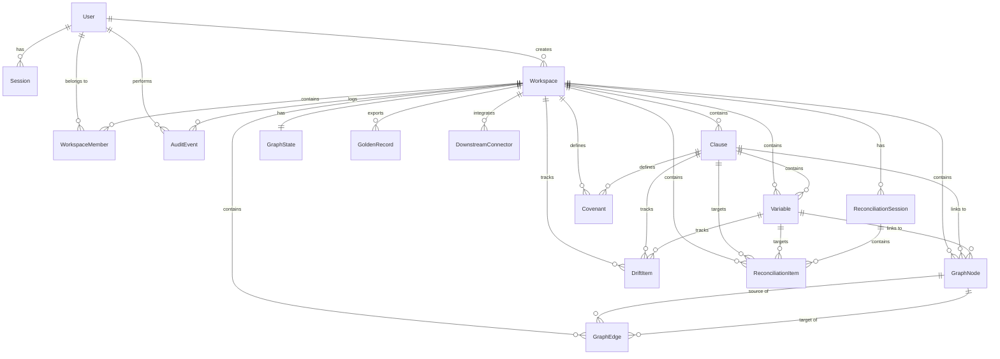

# LMA Nexus - Database Schema

## Overview

PostgreSQL schema for LMA Nexus using **Prisma ORM** (PostgreSQL via Neon).

The schema is **fully aligned** with **frontend domain types** (`lma-nexus/src/types/**`):
- **Users & Sessions** for authentication
- **Workspaces & Members** for multi-tenant isolation with RBAC
- **Clauses & Variables** for structured document content
- **Graph Nodes & Edges** for dependency visualization
- **Graph State** for cached integrity metrics
- **Drift Items** for commercial drift detection
- **Reconciliation Sessions & Items** for AI-driven markup reconciliation
- **Golden Records & Connectors** for export and downstream integration
- **Covenants** for financial covenant tracking
- **Audit Events** with immutable audit trail
- **Refresh Tokens** for JWT authentication

**Key Features:**
- Uses **CUID** identifiers (not UUID) for better performance
- All enums match frontend TypeScript types exactly
- Foreign keys with proper CASCADE/SET NULL behaviors
- Comprehensive indexes for query performance
- Immutable audit trail

This document shows the Prisma schema. For actual SQL migrations, run `prisma migrate dev`.

---

## Running Migrations

```bash
cd backend
pnpm install
pnpm prisma migrate dev --name initial_frontend_aligned_schema
pnpm prisma generate
```

---

## Prisma Schema Overview

The complete Prisma schema is located at `backend/prisma/schema.prisma`.

**Key Design Decisions:**
- **CUID vs UUID**: Using CUID for better randomness and URL-safety
- **Enums**: All enums exactly match frontend TypeScript types
- **Relations**: Proper CASCADE and SET NULL behaviors
- **Timestamps**: Automatic `created_at` and `updated_at` tracking
- **Indexes**: Strategic indexing for common query patterns

---

## 1. Enums - Aligned with Frontend Types

All enums are defined to match the frontend TypeScript union types exactly:

```prisma
// From user.ts
enum Role {
  agent
  legal
  risk
  investor
}

enum MemberStatus {
  active
  pending
  removed
}

// From document.ts
enum ClauseType {
  financial
  covenant
  definition
  xref
  general
}

enum VariableType {
  financial
  definition
  covenant
  ratio
}

// From graph.ts
enum NodeType {
  financial
  covenant
  definition
  xref
}

// From drift.ts
enum DriftSeverity {
  HIGH
  MEDIUM
  LOW
}

enum DriftStatus {
  unresolved
  overridden
  reverted
  approved
}

// From reconciliation.ts
enum ConfidenceLevel {
  HIGH
  MEDIUM
  LOW
}

enum ReconciliationDecision {
  pending
  applied
  rejected
}

enum ReconciliationFileType {
  docx
  pdf
}

// From golden-record.ts
enum ConnectorStatus {
  READY
  IN_REVIEW
  DISCONNECTED
}

enum ConnectorType {
  LoanIQ
  Finastra
  Allvue
  CovenantTracker
}

enum GoldenRecordStatus {
  READY
  IN_REVIEW
}

// From audit.ts
enum AuditEventType {
  LOGIN
  LOGOUT
  WORKSPACE_CREATE
  INVITE_SENT
  ROLE_CHANGED
  MEMBER_REMOVED
  CLAUSE_EDIT
  VARIABLE_EDIT
  VARIABLE_BIND
  GRAPH_SYNC
  DRIFT_OVERRIDE
  DRIFT_REVERT
  DRIFT_APPROVE
  RECON_APPLY
  RECON_REJECT
  PUBLISH
  EXPORT_JSON
  EXPORT_AUDIT
  GOVERNANCE_UPDATED
  SECTION_LOCKED
  SECTION_UNLOCKED
}

enum ReasonCategory {
  borrower_request
  market_conditions
  credit_update
  legal_requirement
  other
}
```

---

## 2. Users & Sessions

```prisma
model User {
  id        String   @id @default(cuid())
  email     String   @unique
  password  String
  name      String
  avatarUrl String?  @map("avatar_url")
  createdAt DateTime @default(now()) @map("created_at")
  updatedAt DateTime @updatedAt @map("updated_at")

  sessions                Session[]
  workspaceMembers        WorkspaceMember[]
  workspacesCreated       Workspace[]             @relation("WorkspaceCreator")
  clausesLocked           Clause[]                @relation("ClauseLockUser")
  clausesModified         Clause[]                @relation("ClauseModifiedBy")
  variablesModified       Variable[]              @relation("VariableModifiedBy")
  driftItemsModified      DriftItem[]             @relation("DriftCurrentModifiedBy")
  driftItemsApproved      DriftItem[]             @relation("DriftApprovedBy")
  reconciliationUploads   ReconciliationSession[]
  reconciliationDecisions ReconciliationItem[]
  auditEvents             AuditEvent[]

  @@map("users")
}

model Session {
  id        String   @id @default(cuid())
  userId    String   @map("user_id")
  createdAt DateTime @default(now()) @map("created_at")
  expiresAt DateTime @map("expires_at")

  user User @relation(fields: [userId], references: [id], onDelete: Cascade)

  @@map("sessions")
}

model RefreshToken {
  id        String    @id @default(cuid())
  token     String    @unique
  userId    String    @map("user_id")
  expiresAt DateTime  @map("expires_at")
  createdAt DateTime  @default(now()) @map("created_at")
  revokedAt DateTime? @map("revoked_at")

  @@index([userId])
  @@index([expiresAt])
  @@map("refresh_tokens")
}
```

---

## 3. Workspaces

```prisma
model Workspace {
  id              String   @id @default(cuid())
  name            String
  currency        String   @default("USD")
  amount          Float    @default(0)
  standard        String   @default("LMA")
  basePdfName     String?  @map("base_pdf_name")
  createdAt       DateTime @default(now()) @map("created_at")
  lastSyncAt      DateTime @default(now()) @map("last_sync_at")
  createdById     String   @map("created_by_id")
  governanceRules Json     @default("{}") @map("governance_rules")
  updatedAt       DateTime @updatedAt @map("updated_at")

  createdBy              User                    @relation("WorkspaceCreator", fields: [createdById], references: [id])
  members                WorkspaceMember[]
  clauses                Clause[]
  variables              Variable[]
  graphNodes             GraphNode[]
  graphEdges             GraphEdge[]
  graphState             GraphState?
  driftItems             DriftItem[]
  reconciliationSessions ReconciliationSession[]
  reconciliationItems    ReconciliationItem[]
  auditEvents            AuditEvent[]
  goldenRecords          GoldenRecord[]
  covenants              Covenant[]
  downstreamConnectors   DownstreamConnector[]

  @@map("workspaces")
}

model WorkspaceMember {
  id          String       @id @default(cuid())
  workspaceId String       @map("workspace_id")
  userId      String       @map("user_id")
  role        Role         @default(investor)
  isAdmin     Boolean      @default(false) @map("is_admin")
  status      MemberStatus @default(pending)
  invitedAt   DateTime     @default(now()) @map("invited_at")
  joinedAt    DateTime?    @map("joined_at")

  user      User      @relation(fields: [userId], references: [id], onDelete: Cascade)
  workspace Workspace @relation(fields: [workspaceId], references: [id], onDelete: Cascade)

  @@unique([userId, workspaceId])
  @@index([workspaceId])
  @@index([userId])
  @@index([status])
  @@map("workspace_members")
}
```

---

## 4. Documents (Clauses & Variables)

```prisma
model Clause {
  id             String     @id @default(cuid())
  workspaceId    String     @map("workspace_id")
  title          String
  body           String
  type           ClauseType
  order          Int
  isSensitive    Boolean    @default(false) @map("is_sensitive")
  isLocked       Boolean    @default(false) @map("is_locked")
  lockedBy       String?    @map("locked_by")
  lockedAt       DateTime?  @map("locked_at")
  lastModifiedAt DateTime   @default(now()) @map("last_modified_at")
  lastModifiedBy String     @map("last_modified_by")
  createdAt      DateTime   @default(now()) @map("created_at")
  updatedAt      DateTime   @updatedAt @map("updated_at")

  workspace           Workspace            @relation(fields: [workspaceId], references: [id], onDelete: Cascade)
  lockedByUser        User?                @relation("ClauseLockUser", fields: [lockedBy], references: [id])
  lastModifiedByUser  User                 @relation("ClauseModifiedBy", fields: [lastModifiedBy], references: [id])
  variables           Variable[]
  driftItems          DriftItem[]
  reconciliationItems ReconciliationItem[]
  graphNodes          GraphNode[]
  covenants           Covenant[]

  @@unique([workspaceId, order])
  @@index([workspaceId])
  @@index([type])
  @@index([isLocked])
  @@map("clauses")
}

model Variable {
  id             String       @id @default(cuid())
  workspaceId    String       @map("workspace_id")
  clauseId       String       @map("clause_id")
  label          String
  type           VariableType
  value          String
  unit           String?
  baselineValue  String?      @map("baseline_value")
  createdAt      DateTime     @default(now()) @map("created_at")
  lastModifiedAt DateTime     @default(now()) @map("last_modified_at")
  lastModifiedBy String?      @map("last_modified_by")
  updatedAt      DateTime     @updatedAt @map("updated_at")

  workspace           Workspace            @relation(fields: [workspaceId], references: [id], onDelete: Cascade)
  clause              Clause               @relation(fields: [clauseId], references: [id], onDelete: Cascade)
  lastModifiedByUser  User?                @relation("VariableModifiedBy", fields: [lastModifiedBy], references: [id])
  driftItems          DriftItem[]
  reconciliationItems ReconciliationItem[]
  graphNodes          GraphNode[]

  @@index([workspaceId])
  @@index([clauseId])
  @@index([type])
  @@map("variables")
}
```

---

## 5. Graph

```prisma
model GraphNode {
  id          String   @id @default(cuid())
  workspaceId String   @map("workspace_id")
  label       String
  type        NodeType
  clauseId    String?  @map("clause_id")
  variableId  String?  @map("variable_id")
  value       String?
  hasDrift    Boolean  @default(false) @map("has_drift")
  hasWarning  Boolean  @default(false) @map("has_warning")
  createdAt   DateTime @default(now()) @map("created_at")
  updatedAt   DateTime @updatedAt @map("updated_at")

  workspace Workspace   @relation(fields: [workspaceId], references: [id], onDelete: Cascade)
  clause    Clause?     @relation(fields: [clauseId], references: [id], onDelete: SetNull)
  variable  Variable?   @relation(fields: [variableId], references: [id], onDelete: SetNull)
  edgesFrom GraphEdge[] @relation("GraphEdgeFrom")
  edgesTo   GraphEdge[] @relation("GraphEdgeTo")

  @@index([workspaceId])
  @@index([type])
  @@index([clauseId])
  @@index([variableId])
  @@map("graph_nodes")
}

model GraphEdge {
  id          String   @id @default(cuid())
  workspaceId String   @map("workspace_id")
  sourceId    String   @map("source_id")
  targetId    String   @map("target_id")
  weight      Int      @default(1)
  createdAt   DateTime @default(now()) @map("created_at")

  workspace Workspace @relation(fields: [workspaceId], references: [id], onDelete: Cascade)
  source    GraphNode @relation("GraphEdgeFrom", fields: [sourceId], references: [id], onDelete: Cascade)
  target    GraphNode @relation("GraphEdgeTo", fields: [targetId], references: [id], onDelete: Cascade)

  @@unique([workspaceId, sourceId, targetId])
  @@index([workspaceId])
  @@index([sourceId])
  @@index([targetId])
  @@map("graph_edges")
}

model GraphState {
  id             String   @id @default(cuid())
  workspaceId    String   @unique @map("workspace_id")
  integrityScore Float    @default(1) @map("integrity_score")
  lastComputedAt DateTime @default(now()) @map("last_computed_at")

  workspace Workspace @relation(fields: [workspaceId], references: [id], onDelete: Cascade)

  @@map("graph_state")
}
```

---

## 6. Drift

```prisma
model DriftItem {
  id                 String        @id @default(cuid())
  workspaceId        String        @map("workspace_id")
  clauseId           String        @map("clause_id")
  variableId         String?       @map("variable_id")
  title              String
  type               ClauseType
  severity           DriftSeverity
  baselineValue      String        @map("baseline_value")
  baselineApprovedAt DateTime      @map("baseline_approved_at")
  currentValue       String        @map("current_value")
  currentModifiedAt  DateTime      @map("current_modified_at")
  currentModifiedBy  String        @map("current_modified_by")
  status             DriftStatus   @default(unresolved)
  approvedBy         String?       @map("approved_by")
  approvedAt         DateTime?     @map("approved_at")
  approvalReason     String?       @map("approval_reason")
  createdAt          DateTime      @default(now()) @map("created_at")
  updatedAt          DateTime      @updatedAt @map("updated_at")

  workspace             Workspace @relation(fields: [workspaceId], references: [id], onDelete: Cascade)
  clause                Clause    @relation(fields: [clauseId], references: [id], onDelete: Cascade)
  variable              Variable? @relation(fields: [variableId], references: [id], onDelete: SetNull)
  currentModifiedByUser User      @relation("DriftCurrentModifiedBy", fields: [currentModifiedBy], references: [id])
  approvedByUser        User?     @relation("DriftApprovedBy", fields: [approvedBy], references: [id])

  @@index([workspaceId])
  @@index([clauseId])
  @@index([variableId])
  @@index([severity])
  @@index([status])
  @@map("drift_items")
}
```
    CONSTRAINT fk_clauses_last_modified_by
        FOREIGN KEY (last_modified_by) 
        REFERENCES users(id) 
        ON DELETE RESTRICT
);

-- Indexes
CREATE INDEX idx_clauses_workspace_id ON clauses(workspace_id);
CREATE INDEX idx_clauses_workspace_order ON clauses(workspace_id, order_index);
CREATE INDEX idx_clauses_workspace_type ON clauses(workspace_id, type);
CREATE INDEX idx_clauses_body_search ON clauses USING gin(to_tsvector('english', body));

-- =============================================================================
-- VARIABLES TABLE
-- Bound financial variables extracted from clauses
-- =============================================================================
CREATE TYPE variable_type AS ENUM ('financial', 'definition', 'covenant', 'ratio');

CREATE TABLE variables (
    id UUID PRIMARY KEY DEFAULT uuid_generate_v4(),
    workspace_id UUID NOT NULL,
    clause_id UUID NOT NULL,
    label VARCHAR(255) NOT NULL,
    type variable_type NOT NULL,
    value TEXT NOT NULL,
    unit VARCHAR(20),
    baseline_value TEXT,
    created_at TIMESTAMPTZ NOT NULL DEFAULT NOW(),
    last_modified_at TIMESTAMPTZ NOT NULL DEFAULT NOW(),
    
    CONSTRAINT fk_variables_workspace
        FOREIGN KEY (workspace_id) 
        REFERENCES workspaces(id) 
        ON DELETE CASCADE,
        
    CONSTRAINT fk_variables_clause
        FOREIGN KEY (clause_id) 
        REFERENCES clauses(id) 
        ON DELETE CASCADE
);

-- Indexes
CREATE INDEX idx_variables_workspace_id ON variables(workspace_id);
CREATE INDEX idx_variables_clause_id ON variables(clause_id);
```

---

## 4. Graph

```sql
-- =============================================================================
-- GRAPH NODES TABLE
-- Dependency graph visualization nodes
-- =============================================================================
CREATE TYPE node_type AS ENUM ('financial', 'covenant', 'definition', 'xref');

CREATE TABLE graph_nodes (
    id UUID PRIMARY KEY DEFAULT uuid_generate_v4(),
    workspace_id UUID NOT NULL,
    label VARCHAR(255) NOT NULL,
    type node_type NOT NULL,
    clause_id UUID,
    variable_id UUID,
    value TEXT,
    has_drift BOOLEAN NOT NULL DEFAULT FALSE,
    has_warning BOOLEAN NOT NULL DEFAULT FALSE,
    
    CONSTRAINT fk_graph_nodes_workspace
        FOREIGN KEY (workspace_id) 
        REFERENCES workspaces(id) 
        ON DELETE CASCADE,
        
    CONSTRAINT fk_graph_nodes_clause
        FOREIGN KEY (clause_id) 
        REFERENCES clauses(id) 
        ON DELETE SET NULL,
        
    CONSTRAINT fk_graph_nodes_variable
        FOREIGN KEY (variable_id) 
        REFERENCES variables(id) 
        ON DELETE SET NULL
);

-- Indexes
CREATE INDEX idx_graph_nodes_workspace_id ON graph_nodes(workspace_id);
CREATE INDEX idx_graph_nodes_clause_id ON graph_nodes(clause_id);
CREATE INDEX idx_graph_nodes_variable_id ON graph_nodes(variable_id);

-- =============================================================================
-- GRAPH EDGES TABLE
-- Dependency relationships between nodes
-- =============================================================================
CREATE TABLE graph_edges (
    id UUID PRIMARY KEY DEFAULT uuid_generate_v4(),
    workspace_id UUID NOT NULL,
    source_id UUID NOT NULL,
    target_id UUID NOT NULL,
    weight INTEGER NOT NULL DEFAULT 1,
    
    CONSTRAINT fk_graph_edges_workspace
        FOREIGN KEY (workspace_id) 
        REFERENCES workspaces(id) 
        ON DELETE CASCADE,
        
    CONSTRAINT fk_graph_edges_source
        FOREIGN KEY (source_id) 
        REFERENCES graph_nodes(id) 
        ON DELETE CASCADE,
        
    CONSTRAINT fk_graph_edges_target
        FOREIGN KEY (target_id) 
        REFERENCES graph_nodes(id) 
        ON DELETE CASCADE,
        
    CONSTRAINT graph_edges_weight_check 
        CHECK (weight BETWEEN 1 AND 5)
);

-- Indexes
CREATE INDEX idx_graph_edges_workspace_id ON graph_edges(workspace_id);
CREATE INDEX idx_graph_edges_source_id ON graph_edges(source_id);
CREATE INDEX idx_graph_edges_target_id ON graph_edges(target_id);
```

---

## 5. Drift

```sql
-- =============================================================================
-- DRIFT ITEMS TABLE
-- Commercial drift detection results
-- =============================================================================
CREATE TYPE drift_severity AS ENUM ('HIGH', 'MEDIUM', 'LOW');
CREATE TYPE drift_status AS ENUM ('unresolved', 'overridden', 'reverted', 'approved');

CREATE TABLE drift_items (
    id UUID PRIMARY KEY DEFAULT uuid_generate_v4(),
    workspace_id UUID NOT NULL,
    clause_id UUID NOT NULL,
    variable_id UUID,
    title VARCHAR(255) NOT NULL,
    type clause_type NOT NULL,
    severity drift_severity NOT NULL,
    baseline_value TEXT NOT NULL,
    baseline_approved_at TIMESTAMPTZ NOT NULL,
    current_value TEXT NOT NULL,
    current_modified_at TIMESTAMPTZ NOT NULL,
    current_modified_by UUID NOT NULL,
    status drift_status NOT NULL DEFAULT 'unresolved',
    approved_by UUID,
    approved_at TIMESTAMPTZ,
    approval_reason TEXT,
    
    CONSTRAINT fk_drift_items_workspace
        FOREIGN KEY (workspace_id) 
        REFERENCES workspaces(id) 
        ON DELETE CASCADE,
        
    CONSTRAINT fk_drift_items_clause
        FOREIGN KEY (clause_id) 
        REFERENCES clauses(id) 
        ON DELETE CASCADE,
        
    CONSTRAINT fk_drift_items_variable
        FOREIGN KEY (variable_id) 
        REFERENCES variables(id) 
        ON DELETE SET NULL,
        
    CONSTRAINT fk_drift_items_modified_by
        FOREIGN KEY (current_modified_by) 
        REFERENCES users(id) 
        ON DELETE RESTRICT,
        
    CONSTRAINT fk_drift_items_approved_by
        FOREIGN KEY (approved_by) 
        REFERENCES users(id) 
        ON DELETE SET NULL
);

-- Indexes
CREATE INDEX idx_drift_items_workspace_id ON drift_items(workspace_id);
CREATE INDEX idx_drift_items_workspace_status ON drift_items(workspace_id, status);
CREATE INDEX idx_drift_items_workspace_severity ON drift_items(workspace_id, severity);
CREATE INDEX idx_drift_items_clause_id ON drift_items(clause_id);
```

---

## 7. Reconciliation

```prisma
model ReconciliationSession {
  id            String                 @id @default(cuid())
  workspaceId   String                 @map("workspace_id")
  fileName      String                 @map("file_name")
  fileType      ReconciliationFileType @map("file_type")
  uploadedAt    DateTime               @default(now()) @map("uploaded_at")
  uploadedBy    String                 @map("uploaded_by")
  totalItems    Int                    @default(0) @map("total_items")
  appliedCount  Int                    @default(0) @map("applied_count")
  rejectedCount Int                    @default(0) @map("rejected_count")
  pendingCount  Int                    @default(0) @map("pending_count")
  createdAt     DateTime               @default(now()) @map("created_at")
  updatedAt     DateTime               @updatedAt @map("updated_at")

  workspace      Workspace            @relation(fields: [workspaceId], references: [id], onDelete: Cascade)
  uploadedByUser User                 @relation(fields: [uploadedBy], references: [id])
  items          ReconciliationItem[]

  @@index([workspaceId])
  @@index([uploadedBy])
  @@index([fileType])
  @@map("reconciliation_sessions")
}

model ReconciliationItem {
  id               String                 @id @default(cuid())
  workspaceId      String                 @map("workspace_id")
  sessionId        String                 @map("session_id")
  incomingSnippet  String                 @map("incoming_snippet")
  targetClauseId   String                 @map("target_clause_id")
  targetVariableId String?                @map("target_variable_id")
  confidence       ConfidenceLevel
  baselineValue    String                 @map("baseline_value")
  currentValue     String                 @map("current_value")
  proposedValue    String                 @map("proposed_value")
  decision         ReconciliationDecision @default(pending)
  decisionReason   String?                @map("decision_reason")
  decidedBy        String?                @map("decided_by")
  decidedAt        DateTime?              @map("decided_at")
  createdAt        DateTime               @default(now()) @map("created_at")
  updatedAt        DateTime               @updatedAt @map("updated_at")

  workspace      Workspace             @relation(fields: [workspaceId], references: [id], onDelete: Cascade)
  session        ReconciliationSession @relation(fields: [sessionId], references: [id], onDelete: Cascade)
  targetClause   Clause                @relation(fields: [targetClauseId], references: [id], onDelete: Cascade)
  targetVariable Variable?             @relation(fields: [targetVariableId], references: [id], onDelete: SetNull)
  decidedByUser  User?                 @relation(fields: [decidedBy], references: [id])

  @@index([workspaceId])
  @@index([sessionId])
  @@index([decision])
  @@index([confidence])
  @@index([targetClauseId])
  @@index([targetVariableId])
  @@map("reconciliation_items")
}
```

---

## 8. Golden Record & Downstream Systems

```prisma
model GoldenRecord {
  id                       String             @id @default(cuid())
  workspaceId              String             @unique @map("workspace_id")
  status                   GoldenRecordStatus @default(IN_REVIEW)
  integrityScore           Float              @default(0) @map("integrity_score")
  unresolvedHighDriftCount Int                @default(0) @map("unresolved_high_drift_count")
  lastExportAt             DateTime?          @map("last_export_at")
  lastPublishAt            DateTime?          @map("last_publish_at")
  schemaJson               String             @default("{}") @map("schema_json")
  createdAt                DateTime           @default(now()) @map("created_at")
  updatedAt                DateTime           @updatedAt @map("updated_at")

  workspace Workspace @relation(fields: [workspaceId], references: [id], onDelete: Cascade)

  @@map("golden_records")
}

model DownstreamConnector {
  id          String          @id @default(cuid())
  workspaceId String          @map("workspace_id")
  name        String
  type        ConnectorType
  status      ConnectorStatus @default(DISCONNECTED)
  lastSyncAt  DateTime?       @map("last_sync_at")
  createdAt   DateTime        @default(now()) @map("created_at")
  updatedAt   DateTime        @updatedAt @map("updated_at")

  workspace Workspace @relation(fields: [workspaceId], references: [id], onDelete: Cascade)

  @@index([workspaceId])
  @@index([type])
  @@index([status])
  @@map("downstream_connectors")
}

model Covenant {
  id               String   @id @default(cuid())
  workspaceId      String   @map("workspace_id")
  name             String
  testFrequency    String   @map("test_frequency")
  threshold        String
  calculationBasis String   @map("calculation_basis")
  clauseId         String   @map("clause_id")
  createdAt        DateTime @default(now()) @map("created_at")
  updatedAt        DateTime @updatedAt @map("updated_at")

  workspace Workspace @relation(fields: [workspaceId], references: [id], onDelete: Cascade)
  clause    Clause    @relation(fields: [clauseId], references: [id], onDelete: Cascade)

  @@index([workspaceId])
  @@index([clauseId])
  @@map("covenants")
}
```

---

## 9. Audit Events (Immutable)

```prisma
model AuditEvent {
  id             String          @id @default(cuid())
  workspaceId    String?         @map("workspace_id")
  timestamp      DateTime        @default(now())
  actorId        String          @map("actor_id")
  actorName      String          @map("actor_name")
  eventType      AuditEventType  @map("event_type")
  targetType     String?         @map("target_type")
  targetId       String?         @map("target_id")
  beforeState    String?         @map("before_state")
  afterState     String?         @map("after_state")
  reason         String?
  reasonCategory ReasonCategory? @map("reason_category")

  workspace Workspace? @relation(fields: [workspaceId], references: [id], onDelete: SetNull)
  actor     User       @relation(fields: [actorId], references: [id])

  @@index([workspaceId])
  @@index([actorId])
  @@index([eventType])
  @@index([timestamp])
  @@map("audit_events")
}
```

**IMPORTANT**: The `audit_events` table is append-only and immutable. Implement middleware or database triggers to prevent UPDATE and DELETE operations.

**Event Types (21 total)**:
- `LOGIN`, `LOGOUT`
- `WORKSPACE_CREATE`, `INVITE_SENT`, `ROLE_CHANGED`, `MEMBER_REMOVED`
- `CLAUSE_EDIT`, `VARIABLE_EDIT`, `VARIABLE_BIND`
- `GRAPH_SYNC`
- `DRIFT_OVERRIDE`, `DRIFT_REVERT`, `DRIFT_APPROVE`
- `RECON_APPLY`, `RECON_REJECT`
- `PUBLISH`, `EXPORT_JSON`, `EXPORT_AUDIT`
- `GOVERNANCE_UPDATED`, `SECTION_LOCKED`, `SECTION_UNLOCKED`

**Reason Categories (5 total)**:
- `borrower_request`, `market_conditions`, `credit_update`, `legal_requirement`, `other`

---

## 10. Database Seeding

For development and testing, use Prisma's seed functionality:

```bash
# backend/prisma/seed.ts
pnpm prisma db seed
```

The seed script (`backend/prisma/seed.ts`) should create:
- Test users with hashed passwords
- Sample workspace with governance rules
- Workspace members with various roles
- Sample clauses and variables
- Example drift items
- Golden record data
- Downstream connectors

---

## Entity Relationship Diagram



---

## Migration Commands

### Initial Setup
```bash
cd backend
pnpm install
pnpm prisma generate
pnpm prisma migrate dev --name initial_frontend_aligned_schema
```

### After Schema Changes
```bash
pnpm prisma migrate dev --name describe_your_changes
pnpm prisma generate
```

### Production Deployment
```bash
pnpm prisma migrate deploy
pnpm prisma generate
```

### Reset Database (Development Only)
```bash
pnpm prisma migrate reset
```

---

## Data Access Layer Example

Using Prisma Client in your services:

```typescript
import { PrismaClient } from '@prisma/client';

const prisma = new PrismaClient();

// Fetch workspace with all members
async function getWorkspaceWithMembers(workspaceId: string) {
  return await prisma.workspace.findUnique({
    where: { id: workspaceId },
    include: {
      members: {
        include: {
          user: true
        }
      },
      createdBy: true
    }
  });
}

// Fetch drift items with filters
async function getDriftItems(
  workspaceId: string,
  filters: { status?: DriftStatus; severity?: DriftSeverity }
) {
  return await prisma.driftItem.findMany({
    where: {
      workspaceId,
      ...(filters.status && { status: filters.status }),
      ...(filters.severity && { severity: filters.severity })
    },
    include: {
      clause: true,
      variable: true,
      currentModifiedByUser: true,
      approvedByUser: true
    },
    orderBy: {
      currentModifiedAt: 'desc'
    }
  });
}

// Create audit event
async function logAuditEvent(data: {
  workspaceId?: string;
  actorId: string;
  actorName: string;
  eventType: AuditEventType;
  targetType?: string;
  targetId?: string;
  beforeState?: string;
  afterState?: string;
  reason?: string;
  reasonCategory?: ReasonCategory;
}) {
  return await prisma.auditEvent.create({
    data
  });
}
```

---

## Performance Optimization

### Indexing Strategy
All critical query patterns have appropriate indexes:
- Foreign keys (automatic indexing)
- Unique constraints (workspace member per user, graph edges)
- Filter fields (status, type, severity)
- Timestamp fields for chronological queries

### Connection Pooling
Configure Prisma with connection pooling for Neon:

```prisma
datasource db {
  provider  = "postgresql"
  url       = env("DATABASE_URL")
  directUrl = env("DIRECT_URL")
}
```

Where:
- `DATABASE_URL` - Pooled connection (use for queries)
- `DIRECT_URL` - Direct connection (use for migrations)

---

## Schema Version

**Current Version**: `20251228041948_initial_frontend_aligned_schema`  
**Last Updated**: December 28, 2025  
**Status**: ✅ Frontend-Aligned & Production-Ready
